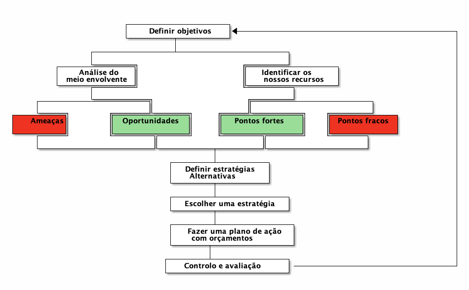

[Início](./index.md) [UC8](./unidade_viii.md)

# Planeamento

De acordo com [Ackoff](https://en.wikipedia.org/wiki/Russell_L._Ackoff), ”Planear é conceber um futuro desejado e os meios para aí chegar”.

-   Planear envolve:
    -   escolher um destino;
    -   avaliar caminhos altemativos;
    -   decidir por onde ir para se atingir o destino predefinido.

-   Planear é uma atividade contínua e sistemática. Envolve todos dentro da organização e pressupõe ajustamentos permanentes entre os diferentes departamentos:

-   O planeamento estratégico define a longo prazo qual a missão da organização.

-   Do planeamento realizado para um período entre 1 e 5 anos resulta um plano.

-   O dia a dia da empresa é refletido pelo planeamento operacional.

-   As principais fases de qualquer processo de planeamento são:
    -   o estabelecimento de objetivos,
    -   a análise do contexto extemo,
    -   a identificação dos recursos da empresa,
    -   a definição de estratégias, a sele ção de estratégias,
    -   a elaboração de um plano de ação e orçamentos e
    -   o controlo.

